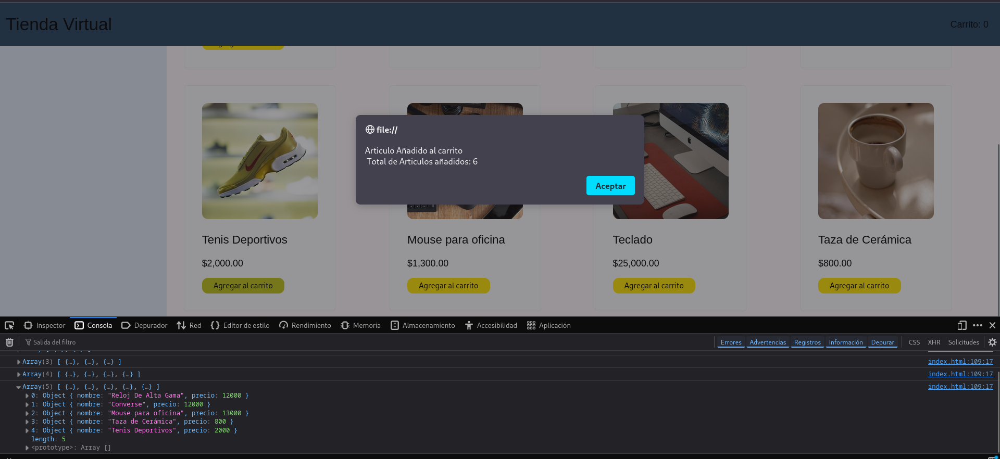

# Sección 2: Lógica con JavaScript para Interactividad
## Instrucción:
Añade interactividad a la página creada en la Sección 1. Se deben cumplir los siguientes
requisitos:
- Implementa un botón en cada producto del grid que, al hacer clic, lo agregue a un
carrito de compras.
- Muestra una notificación en la parte superior de la pantalla que indique la cantidad
de productos agregados al carrito.

## Requisitos:
- Utiliza JavaScript puro (sin bibliotecas externas).
- Los productos deben ser almacenados en un array que represente el carrito.
- La notificación debe ser dinámica y actualizarse en tiempo real cada vez que se
agregue un nuevo producto.

Para este ejercicio, lo que quisiera destacar es el uso de las propiedad display:grid de css. 

---
## Propuesta

De momento y, al tratar con datos estaticos, la forma en la que guardamos los datos del producto para enviarlos a la funcion de javascript será a tráves del botón para añadir al carrito con la propiedad onclick:

```html
<button class="buyButton" onclick="carrito('Taza de Cerámica', 800)">Agregar al carrito</button>
```

Para realizar esta actividad vamos a hacer uso de los arreglos. Creamos una variable de tipo array

```javascript
    let corritoItems = [];
```

Creamos una función a la que llamaos "carrito", la cual contendrá la lógica: 
- Función que necesite los argumentos "nombre" y "precio" que se empezarán a registrar dentro del arreglo.
- Dentro de la función, tendremos una const que contendrá los valores para el nombre del producto y el precio.
- Hacer el *push* de los valores de producto al array.
- Usar *alert()* para mandar un mensaje de confirmacion de producto enviado al carrito, con la cantidad de articulos actuales dentro del carrito.  
- Al final, un log de consola para mostrar los articulos que tenemos dentro del array.

```javascript
    function carrito(nombre, precio){
        const producto = {
            nombre: nombre,
            precio: precio
        }
        carritoItems.push(producto);
        alert("Producto añadido al carrito!!\nTotal de articulos añadidos" + carritoItems.lenght);
        console.log(carritoItems);
    }
```

El resultado es el siguiente:
